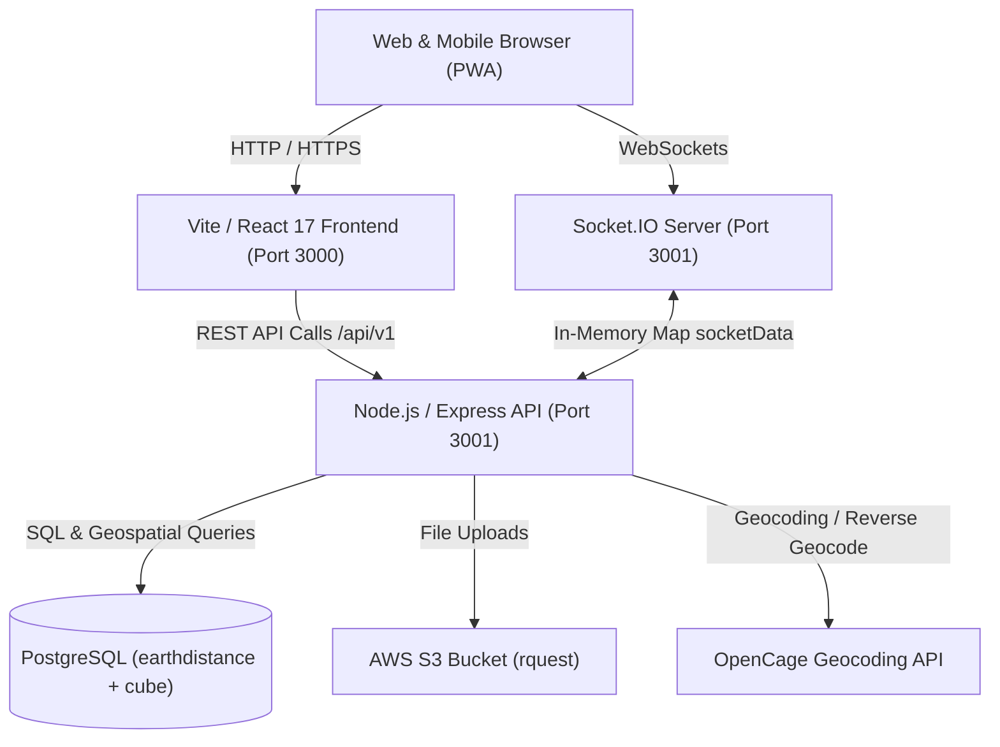
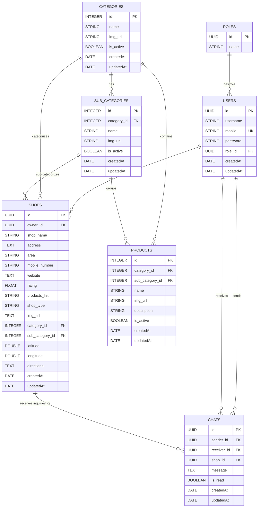

# Rquest - Project Architecture & Comprehensive Analysis

## 1. Executive Summary & Vision

**Rquest** ("*Connect Everywhere Everything*") is a **hyper-local marketplace and directory application** built to connect physical retail merchants with nearby local customers.

### Key Pillars:
1. **Proximity Search & Store Discovery**: Customers search for goods or shops within their immediate geographic radius using live GPS coordinates and geospatial queries powered by PostgreSQL's `earthdistance` extension.
2. **Real-Time Consumer-Merchant Messaging**: Customers can chat directly with shop owners via WebSockets (Socket.IO) before making an in-person visit.
3. **Merchant Onboarding & Shop Management**: Store owners register their retail outlets, configure location pins on interactive Leaflet maps, assign categories, and maintain contact information.
4. **Admin Taxonomy & Catalog System**: Back-office administrators manage a hierarchical classification tree: `Category` $\rightarrow$ `SubCategory` $\rightarrow$ `Products`.

---

## 2. System Architecture & High-Level Flow

The application is structured as a **full-stack monorepo** containing both the Express backend and the Vite/React frontend.



### High-Level Directory Layout
```
rquest/
├── src/
│   ├── server.js              # Express HTTP + Socket.io server entry point
│   ├── api/                   # Backend Application Layer
│   │   ├── auth/              # JWT token generation, verification & bcrypt hashing
│   │   ├── config/            # Database connection configurations
│   │   ├── migrations/        # Sequelize database schema migration files
│   │   ├── models/            # Sequelize ORM schema definitions & associations
│   │   ├── routes/            # REST endpoint routers (user, shops, chats, master)
│   │   └── seeders/           # Initial database fixtures (roles, users, shops, categories)
│   ├── app/                   # Frontend Core Application Layer
│   │   ├── components/        # Reusable UI widgets (Leaflet maps, Chat, ShopCard, DataTable)
│   │   ├── routes/            # React Router v5 config & PrivateRoute guards
│   │   ├── services/          # Zustand global store & chat state store
│   │   └── utils/             # Fetch client (netWorkCall), Socket.io client, helpers
│   ├── screens/               # Application Views (Home, Login, Register, ClientRegister, Admin)
├── py.sh/                     # Utility Python script for parsing Excel & Google Maps GPS data
├── vite.config.js             # Vite 5 client build & PWA manifest setup
└── package.json               # Monorepo dependencies and unified scripts
```

---

## 3. Technology Stack Reference

| Domain | Technology | Version | Purpose |
|---|---|---|---|
| **Client Framework** | React | `17.0.2` | Single Page Application UI |
| **Client Bundler** | Vite | `5.0.8` | Fast HMR dev server & asset bundling |
| **Client Routing** | react-router-dom | `5.3.0` | Client-side routing with `Switch` & `Route` |
| **UI Components** | Ant Design (`antd`) | `5.8.3` | UI components, layouts, forms, buttons |
| **Icons** | `@ant-design/icons` | `5.2.5` | Iconography |
| **Interactive Maps** | Leaflet / react-leaflet | `1.9.4` / `4.2.1` | Map rendering, custom color pins, dragging |
| **Geosearch** | leaflet-geosearch | `3.11.0` | OpenStreetMap location search box on map |
| **Client State** | Zustand | `4.4.7` | Lightweight session-persisted state management |
| **Server Framework** | Express | `4.17.1` | REST API layer mounted on `/api/v1` |
| **Real-time Engine** | Socket.IO | `4.7.2` | Bi-directional real-time communication |
| **Database & ORM** | PostgreSQL + Sequelize | `pg 8.11.3` / `6.35.1` | Relational storage & schema modeling |
| **Geospatial Engine** | PostgreSQL `earthdistance` | Extension | Earth coordinate distance calculations |
| **Object Storage** | AWS SDK | `2.1565.0` | Media uploads to AWS S3 bucket |
| **Authentication** | JSON Web Tokens (`jsonwebtoken`) | `9.0.2` | Stateless bearer token authentication |
| **Password Security**| `bcrypt` | `5.1.1` | Password salting & hashing |
| **PWA Support** | `vite-plugin-pwa` | `0.17.4` | Offline caching & web app manifest |

---

## 4. Database Schema & Entity Relationships

The data layer uses Sequelize ORM with PostgreSQL. The core data models and relationships are defined below:



### Predefined Roles
- **User** (`c0f93a2f-16c9-49cf-b47b-e0c0a38a5a4d`): Regular consumer who browses shops and initiates chats.
- **Client** (`a5e858d8-636c-4fc3-8c3a-0a76131c95e5`): Retailer / merchant who owns and manages shops.
- **Admin** (`d5e858d8-636c-4fc3-8c3a-0a76131c95e9`): Platform administrator managing categories, subcategories, and products.

---

## 5. Subsystems Overview

### 5.1 Geospatial Engine & Store Search
- **Proximity Computation**: In `src/api/routes/shops/search.js`, queries compute the great-circle distance between user GPS coordinates `(:search_lat, :search_lon)` and shop coordinates `(latitude, longitude)`:
  ```sql
  earth_distance(ll_to_earth(:search_lat, :search_lon), ll_to_earth(latitude, longitude))
  ```
- **Sorting & Filtering**: Results are ordered by `distance ASC` with keyword filters across `shop_name`, `address`, `area`, and `shop_type`.
- **Location Extraction**: The utility `parseGoogleMapsUrl` (`src/api/routes/shops/create.js`) fetches shortened Google Maps URLs and extracts latitude/longitude coordinates via regex (`/@(-?\d+\.\d+),(-?\d+\.\d+)/`).

### 5.2 Real-Time WebSocket Messaging
- **Connection Handshake**: On client load, the user emits `connect_user` passing user details. The Express server maintains an in-memory dictionary `socketData[user_id] = { ...user_data, socket_id: socket.id }`.
- **Message Dispatch**:
  1. Client sends message via REST API `POST /api/v1/chat/create` (persisted to PostgreSQL).
  2. Client emits `send_message` with message payload and `receiver_id` via Socket.IO.
  3. Server routes `receive_message` to the recipient's active `socket.id`.
- **Online Presence**: User online status is resolved in real-time by inspecting whether `socketData[otherUserId]` has an active `socket_id`.

### 5.3 Merchant & Admin Portals
- **Merchant Dashboard (`/client_register`)**: Merchants register physical outlets by providing address details, uploading images to S3/CDN, and pinning their storefront on an interactive Leaflet map. Creating a shop automatically promotes user role to `client`.
- **Admin Console (`/admin`)**: A 3-tier tabbed interface allowing administrators to manage categories, subcategories, and individual products with inline table edits and status toggles.

---

## 6. Critical Bugs, Security Risks & Actionable Fixes

During the in-depth audit, several critical issues were discovered:

### 1. Breaking Auth Regression (Missing `AUTH_TOKEN`)
- **File**: [`src/api/auth/index.js`](file:///home/dev/Freelance/rquest/src/api/auth/index.js#L21-L28)
- **Problem**: `const AUTH_TOKEN = process.env.AUTH_TOKEN;` was removed from the file. Both `generateJwt()` and `verifyJwt()` reference `AUTH_TOKEN` as a global variable, causing a runtime `ReferenceError: AUTH_TOKEN is not defined`.
- **Fix**: Re-introduce `const AUTH_TOKEN = process.env.AUTH_TOKEN || 'your_fallback_secret';`.

### 2. Password Verification Logic in Login (Bcrypt Hash Mismatch)
- **File**: [`src/api/routes/user/login.js`](file:///home/dev/Freelance/rquest/src/api/routes/user/login.js#L9-L19)
- **Problem**: `login.js` re-hashes the user's plain-text password using `generateHash(userDetails.password)` and queries `where: { mobile, password: hashedPassword }`. Because bcrypt uses random salts on each call, re-hashing will **never** equal the stored hash. User logins fail for all salted users.
- **Fix**: Look up user solely by mobile: `const user = await users.findOne({ where: { mobile: userDetails.mobile } });`, then compare using `await bcrypt.compare(userDetails.password, user.password)`.

### 3. Ant Design & React Hook Form Parameter Mismatch
- **Files**: [`src/screens/register/index.jsx`](file:///home/dev/Freelance/rquest/src/screens/register/index.jsx#L15), [`src/screens/login/index.jsx`](file:///home/dev/Freelance/rquest/src/screens/login/index.jsx#L18)
- **Problem**: Ant Design `Form onFinish={handleSubmit(onSubmit)}` passes `(values)` as its first parameter. React Hook Form's `handleSubmit` passes `(data, event)`. With `onSubmit = async (e, data) => ...`, `e` is the data and `data` is the event. Accessing `data.username` or `data.mobile` evaluates to `undefined`, silently failing submissions.
- **Fix**: Either use Ant Design's native `onFinish={(values) => onSubmit(values)}` or pass `onSubmit = async (data) => ...` correctly.

### 4. Primary Key Collisions in Master Data Endpoints
- **Files**: [`category.js`](file:///home/dev/Freelance/rquest/src/api/routes/master/category.js#L55), [`subcategory.js`](file:///home/dev/Freelance/rquest/src/api/routes/master/subcategory.js#L76), [`products.js`](file:///home/dev/Freelance/rquest/src/api/routes/master/products.js#L89)
- **Problem**: New records manually assign `id: count` (using `Model.count()`). If records are deleted, `count` will be less than the highest existing ID, triggering duplicate key primary key constraint violations.
- **Fix**: Remove manual `id` assignment and allow PostgreSQL auto-incrementing serial sequences to generate primary keys.

### 5. Exposed Secrets in Version Control
- **Files**:
  - AWS Credentials hardcoded in [`src/api/routes/master/aws.js#L5-L7`](file:///home/dev/Freelance/rquest/src/api/routes/master/aws.js#L5-L7).
  - EC2 private key file [`rquest-ec2.pem`](file:///home/dev/Freelance/rquest/rquest-ec2.pem) committed to repo root.
  - Production database credentials in [`src/api/config/config.js#L18`](file:///home/dev/Freelance/rquest/src/api/config/config.js#L18).
  - OpenCage API key in [`src/api/routes/user/trace.js#L6`](file:///home/dev/Freelance/rquest/src/api/routes/user/trace.js#L6).
- **Fix**: Move all secrets to environment variables (`.env`) and add `*.pem` and sensitive configs to `.gitignore`.

---

## 7. Development & Deployment Reference

### Environment Variables (`.env`)
```env
PORT=3001
VITE_APP_API_URL=http://localhost:3001
AUTH_TOKEN=your_jwt_secret_key_here
BCRYPT_ROUNDS=12
AWS_ACCESS_KEY_ID=your_aws_key
AWS_SECRET_ACCESS_KEY=your_aws_secret
AWS_REGION=ap-southeast-2
S3_BUCKET_NAME=rquest
OPENCAGE_API_KEY=your_opencage_key
```

### Common Commands
```bash
# Install dependencies
npm install

# Run backend and frontend concurrently
npm run dev

# Run only backend (Nodemon on port 3001)
npm run server:dev

# Run only frontend (Vite on port 3000)
npm run client:dev

# Build client (Vite to dist/app) and server (Babel to dist)
npm run build

# Start production server
npm start
```

