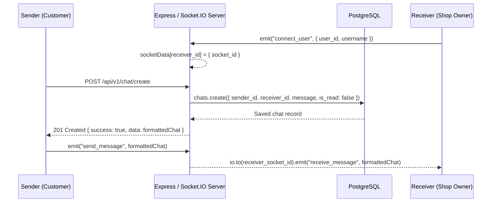

# Rquest - Backend Architecture & Technical Reference

## 1. Overview & Architecture

The backend is built on **Node.js, Express, Socket.IO, and Sequelize ORM**, running with a PostgreSQL database.

### Responsibilities:
1. **REST API (`/api/v1`)**: Handles authentication, user management, geospatial shop search, vendor shop registration, and admin taxonomy management.
2. **WebSocket Gateway**: Manages real-time bi-directional messaging and user online presence via Socket.IO.
3. **Geospatial Processing**: Computes live distances between user coordinates and retail locations using PostgreSQL's `earthdistance` extension.
4. **Cloud Storage**: Handles image uploads to AWS S3 via Multer.
5. **Static Asset Server**: In production, serves Vite-bundled frontend assets from `dist/app`.

---

## 2. Server Entry Point (`src/server.js`)

[`src/server.js`](file:///home/dev/Freelance/rquest/src/server.js) initializes the HTTP and WebSocket services:
- **Middleware Chain**:
  - `cors({ origin: '*', ... })` — Enables cross-origin requests.
  - `bodyParser.json({ limit: '50mb' })` — Parses JSON payloads up to 50MB.
  - Custom middleware: Attaches the global `socketData` map to `req.headers.socketData` for route access.
- **Router Mounting**:
  - `app.use('/api/v1', router)` mounts all API routers from [`src/api/routes/index.js`](file:///home/dev/Freelance/rquest/src/api/routes/index.js).
- **Socket.IO Server**:
  - Created on the same HTTP server instance (`new Server(server, { cors: ... })`).
  - Stores user socket connections in-memory in `socketData`:
    ```javascript
    let socketData = {};
    // user_id -> { ...user_data, socket_id: socket.id }
    ```
  - Routes `send_message` events directly to the target recipient's `socket_id`.

---

## 3. Database Models & Schema Design (`src/api/models/`)

Managed via Sequelize 6.35.1 and PostgreSQL.

### 3.1 `Role` ([`roles.js`](file:///home/dev/Freelance/rquest/src/api/models/roles.js))
- **Table**: `roles`
- **Fields**:
  - `id`: UUID (Primary Key, UUIDV4)
  - `name`: String (`user`, `client`, `admin`)

### 3.2 `User` ([`users.js`](file:///home/dev/Freelance/rquest/src/api/models/users.js))
- **Table**: `users`
- **Fields**:
  - `id`: UUID (Primary Key, UUIDV4)
  - `username`: String
  - `mobile`: String (Unique constraint)
  - `password`: String (Bcrypt hashed)
  - `role_id`: UUID (Foreign Key $\rightarrow$ `roles.id`)
- **Associations**:
  - `hasMany(shops, { foreignKey: 'owner_id', as: 'userShops' })`
  - `hasMany(chats, { foreignKey: 'sender_id', as: 'sentChats' })`
  - `hasMany(chats, { foreignKey: 'receiver_id', as: 'receivedChats' })`

### 3.3 `Shop` ([`shops.js`](file:///home/dev/Freelance/rquest/src/api/models/shops.js))
- **Table**: `shops`
- **Fields**:
  - `id`: UUID (Primary Key, UUIDV4)
  - `owner_id`: UUID (Foreign Key $\rightarrow$ `users.id`)
  - `shop_name`: String
  - `address`: Text
  - `area`: String
  - `mobile_number`: String
  - `website`: Text
  - `rating`: Float
  - `products_list`: String
  - `shop_type`: String
  - `img_url`: Text
  - `category_id`: Integer (Foreign Key $\rightarrow$ `categories.id`)
  - `sub_category_id`: Integer (Foreign Key $\rightarrow$ `sub_categories.id`)
  - `latitude`: Double
  - `longitude`: Double
  - `directions`: Text (Stores Google Maps URL)
- **Associations**:
  - `hasMany(chats, { foreignKey: 'shop_id', as: 'shopChats' })`
  - `belongsTo(categories, { foreignKey: 'category_id', as: 'shopCategory' })`
  - `belongsTo(sub_categories, { foreignKey: 'sub_category_id', as: 'shopSubCategory' })`

### 3.4 Taxonomy: `Category`, `SubCategory`, `Products`
- **`Categories` ([`category.js`](file:///home/dev/Freelance/rquest/src/api/models/category.js))**: `id` (Integer PK), `name`, `img_url`, `is_active` (Boolean).
- **`SubCategories` ([`subcategory.js`](file:///home/dev/Freelance/rquest/src/api/models/subcategory.js))**: `id` (Integer PK), `category_id` (FK), `name`, `img_url`, `is_active` (Boolean).
- **`Products` ([`products.js`](file:///home/dev/Freelance/rquest/src/api/models/products.js))**: `id` (Integer PK), `category_id` (FK), `sub_category_id` (FK), `name`, `img_url`, `description`, `is_active` (Boolean).

### 3.5 `Chat` ([`chats.js`](file:///home/dev/Freelance/rquest/src/api/models/chats.js))
- **Table**: `chats`
- **Fields**:
  - `id`: UUID (Primary Key, UUIDV4)
  - `sender_id`: UUID (Foreign Key $\rightarrow$ `users.id`)
  - `receiver_id`: UUID (Foreign Key $\rightarrow$ `users.id`)
  - `shop_id`: UUID (Foreign Key $\rightarrow$ `shops.id`)
  - `message`: Text
  - `is_read`: Boolean (Default: `true` on creation in model, overridden to `false` in routes)
- **Associations**:
  - `belongsTo(users, { foreignKey: 'sender_id', as: 'sender' })`
  - `belongsTo(users, { foreignKey: 'receiver_id', as: 'receiver' })`
  - `belongsTo(shops, { foreignKey: 'shop_id', as: 'shopChats' })`

---

## 4. Authentication & Middleware Pipeline

Located in [`src/api/auth/index.js`](file:///home/dev/Freelance/rquest/src/api/auth/index.js).

### Token Creation & Verification
- `generateHash(password)`: Hashes password with `bcrypt.hash(password, BCRYPT_ROUNDS)`.
- `generateJwt(payload)`: Signs payload with `jwt.sign(payload, AUTH_TOKEN)`.
- `verifyJwt(token)`: Verifies token with `jwt.verify(token, AUTH_TOKEN)`.

### Request Authorization: `authMiddleware`
1. Extracts `Authorization: Bearer <token>` from incoming headers.
2. Decodes the token using `verifyJwt(token)`.
3. Injects decoded claims (`user_id`, `username`, etc.) directly into `req.headers`.
4. Rejects invalid requests with `HTTP 500 Authentication Failed`.

---

## 5. API Endpoints Specification

Base path: `/api/v1`

### 5.1 User Endpoints (`/user`)
| Method | Endpoint | Auth | Description |
|---|---|---|---|
| `POST` | `/user/register` | No | Creates new user; hashes password; returns JWT token & user data. |
| `POST` | `/user/login` | No | Authenticates user credentials; returns JWT token & user data. |
| `POST` | `/user/trace_ip` | No | Reverse-geocodes `latitude` & `longitude` using OpenCage API. |

### 5.2 Shops Endpoints (`/shops`)
| Method | Endpoint | Auth | Description |
|---|---|---|---|
| `POST` | `/shops/search` | No | Computes proximity using `earth_distance(ll_to_earth(...))` ordered by distance ASC with search query filter. |
| `GET` | `/shops/my_categories` | No | Returns all active categories with their nested subcategories. |
| `POST` | `/shops/my_shops` | Yes | Retrieves all shops owned by `req.headers.user_id`. |
| `POST` | `/shops/link/decode` | Yes | Follows Google Maps redirect URL and extracts `@lat,lng` coordinates. |
| `POST` | `/shops/client_register` | Yes | Creates or updates a shop; auto-promotes user's role to `client`. |

### 5.3 Master Data & Uploads (`/master`)
| Method | Endpoint | Auth | Description |
|---|---|---|---|
| `POST` | `/master/upload` | No | Multer middleware uploads file to AWS S3 (`rquest` bucket) with UUID filename. |
| `POST` | `/master/categories` | Yes | Paginated list of categories with total count (`findAndCountAll`). |
| `PUT` | `/master/categories/status`| Yes | Toggles category `is_active` flag. |
| `POST` | `/master/categories/create`| Yes | Creates new category or updates existing if `category_id` provided. |
| `DELETE`| `/master/categories` | Yes | Cascades deletion of category, subcategories, and products. |
| `POST` | `/master/sub_categories` | Yes | Paginated list of subcategories filtered by `category_id`. |
| `PUT` | `/master/sub_categories/status`| Yes | Toggles subcategory `is_active` flag. |
| `POST` | `/master/sub_categories/create`| Yes | Creates new subcategory or updates existing. |
| `DELETE`| `/master/sub_categories`| Yes | Deletes subcategory and its associated products. |
| `POST` | `/master/products` | Yes | Paginated list of products filtered by category or subcategory. |
| `PUT` | `/master/products/status` | Yes | Toggles product `is_active` flag. |
| `POST` | `/master/products/create` | Yes | Creates new product or updates existing. |
| `DELETE`| `/master/products` | Yes | Deletes product record. |

### 5.4 Chat Endpoints (`/chat`)
| Method | Endpoint | Auth | Description |
|---|---|---|---|
| `POST` | `/chat/create` | Yes | Persists message in DB; returns formatted chat record. |
| `POST` | `/chat/getAllShops` | Yes | Returns all shops where user has conversational history. |
| `POST` | `/chat/getAllUsers` | Yes | Retrieves messages for a specific shop, formatted by other participant with online status. |
| `POST` | `/chat/markAll` | Yes | Updates unread messages array to `is_read: true`. |

---

## 6. Real-Time Communication (Socket.IO)

The WebSocket flow operates in tandem with HTTP endpoints:



---

## 7. Data Pipeline & Scraping Utility (`py.sh`)

The repository contains an auxiliary Python pipeline in [`py.sh/`](file:///home/dev/Freelance/rquest/py.sh/):
- **`sheet.xlsx`**: Excel spreadsheet of vendor records (`shop_name`, `address`, `area`, `directions`, etc.).
- **`parsexl.py`**:
  - Uses `openpyxl` to parse spreadsheet rows.
  - Resolves Google Maps directions links via `requests.get()` to extract `@latitude,longitude`.
  - Serializes enriched records to `output.json`.
- The resulting JSON is seeded into the database via [`src/api/seeders/20231210122421-shops.js`](file:///home/dev/Freelance/rquest/src/api/seeders/20231210122421-shops.js).

---

## 8. Critical Backend Issues & Required Remediation

### Issue 1: Missing `AUTH_TOKEN` in `auth/index.js`
- **Location**: [`src/api/auth/index.js#L22`](file:///home/dev/Freelance/rquest/src/api/auth/index.js#L22)
- **Symptom**: `ReferenceError: AUTH_TOKEN is not defined` on token generation/verification.
- **Fix**:
  ```javascript
  const AUTH_TOKEN = process.env.AUTH_TOKEN || 'fallback_secret_key';
  ```

### Issue 2: Flawed Password Check in `user/login.js`
- **Location**: [`src/api/routes/user/login.js#L9-L19`](file:///home/dev/Freelance/rquest/src/api/routes/user/login.js#L9-L19)
- **Symptom**: Comparing freshly hashed password with DB hash always fails due to bcrypt's unique salt.
- **Fix**:
  ```javascript
  const user = await users.findOne({ where: { mobile: userDetails.mobile } });
  if (!user) {
    return res.status(401).json({ success: false, message: 'Invalid mobile or password' });
  }
  const isMatch = await bcrypt.compare(userDetails.password, user.password);
  if (!isMatch) {
    return res.status(401).json({ success: false, message: 'Invalid mobile or password' });
  }
  ```

### Issue 3: Hardcoded Credentials & Exposed Secrets
- **Locations**:
  - AWS keys in [`src/api/routes/master/aws.js#L5-L7`](file:///home/dev/Freelance/rquest/src/api/routes/master/aws.js#L5-L7)
  - Production DB password in [`src/api/config/config.js#L18`](file:///home/dev/Freelance/rquest/src/api/config/config.js#L18)
  - Hardcoded OpenCage key in [`src/api/routes/user/trace.js#L6`](file:///home/dev/Freelance/rquest/src/api/routes/user/trace.js#L6)
- **Fix**: Read all credentials from `process.env`. Revoke currently exposed keys.

### Issue 4: Manual Primary Key Assignment (`id: count`)
- **Locations**:
  - [`category.js#L55`](file:///home/dev/Freelance/rquest/src/api/routes/master/category.js#L55)
  - [`subcategory.js#L76`](file:///home/dev/Freelance/rquest/src/api/routes/master/subcategory.js#L76)
  - [`products.js#L89`](file:///home/dev/Freelance/rquest/src/api/routes/master/products.js#L89)
- **Symptom**: `count()` produces duplicate IDs when rows have been deleted, throwing unique constraint errors.
- **Fix**: Omit `id` during `.create()` and let PostgreSQL auto-incrementing serial primary keys manage identity.

### Issue 5: Undefined Variable in `chat/getAll`
- **Location**: [`src/api/routes/chats/chats.js#L55`](file:///home/dev/Freelance/rquest/src/api/routes/chats/chats.js#L55)
- **Symptom**: `chatDetails.receiver_id` throws `ReferenceError: chatDetails is not defined`.
- **Fix**: Retrieve `receiver_id` from `req.body.receiver_id`.

